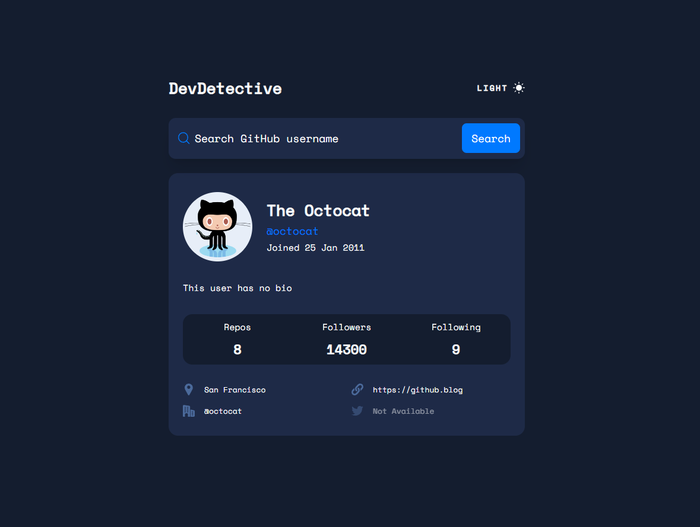

# Frontend Mentor - GitHub user search app solution

This is a solution to the [GitHub user search app challenge on Frontend Mentor](https://www.frontendmentor.io/challenges/github-user-search-app-Q09YOgaH6). Frontend Mentor challenges help you improve your coding skills by building realistic projects.

## Table of contents

- [Screenshot](#screenshot)
- [Built with](#built-with)
- [What I learned](#what-i-learned)
- [Author](#author)

### Screenshot

- Live Site URL: ()

### Built with

- [Github Users API](https://docs.github.com/en/rest/users/users?apiVersion=2022-11-28#get-a-user-using-their-id)
- NextJS & TailwindCSS
- Typescript

### What I learned

- Using axios for fetching data from the github users api
- Enhanced my knowledge of TypeScript
- Creating a theme toggle switch with tailwind
- Learned about some, not so common properties and classes such as `spellcheck` & `caret-color` on inputs

## Author

- LinkedIn - [Muhammad Raza](https://www.linkedin.com/in/frontend-developer-muhammad-raza/)
- Frontend Mentor - [@illusiveCode](https://www.frontendmentor.io/profile/illusiveCode)

### Thanks for reading!
